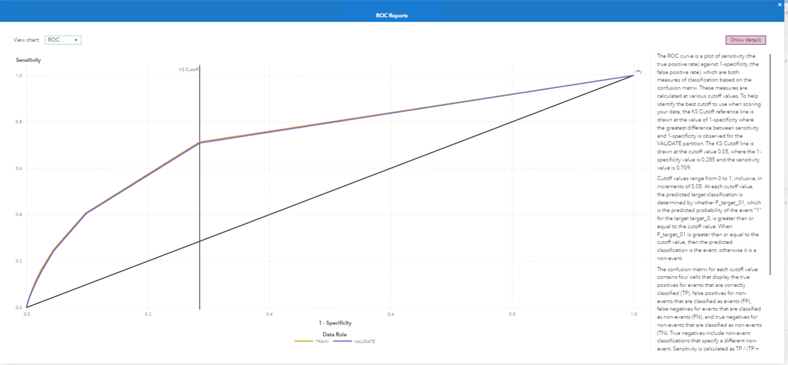

# Scotiabank Data Science Challenge
The Scotiabank Data Science Challenge invites participants to engineer machine learning models, optimizing a large financial institution's loan approval system. The challenge focuses on the banking procedure of accurately evaluating an applicant's creditworthiness, balancing the act of maximizing interest revenues while minimizing potential losses from loan delinquencies.

# Process
## Step 1: Data Preprocessing and Cleaning 📊
- **Variable Management**: Utilized the "Manage Variable" node to refine our dataset, assigning new roles and levels for more preprocessed, precise analysis. For instance, this included converting numerical variables from a "nominal" level to an "ordinal" level, which led to a more accurate input analysis.

- **Feature Machine**: Deployed the "Feature Machine" node, a data preprocessing tool for feature extraction and data organization. This node handled data irregularities by using various techniques, such as imputation to fill missing values through advanced median and mean calculations. We used transformation policies focusing on Cardinality, Kurtosis, Missingness, Outliers, and Skewness. The number of features per input was set to 8 to maximize net profit without overfitting the model.

## Step 2: Logistic Regression Model 🧠
- **Model Selection**: Adopted a `Logistic Regression` model due to its supervised machine learning algorithm used for binary classification tasks.
- **Methodology**: Applied a `generalized logit` function for its capacity to handle multicategorical response variables, paired with a `Stepwise` method to refine feature selection based on statistical significance.

## Step 3: Data Visualization and Analysis 📈
- Employed detailed histograms to visualize applicant data, focusing specifically on the delinquency rates within the 0-6% interval. Post-analysis, we compiled and exported the selected applicant IDs into a CSV file.

# Results 🥇

By leveraging **Cortex Analytics**, powered by **SAS**, our model achieved the **highest net profit** and ranked **first place** on the leaderboard.
- **Net Profit**: $548,214,371.75
- **Approved Applicants**: 756,054 applicants

## ROC (Receiver Operating Characteristic) Graph Analysis 📝

- The orange curve represents the training data set, while the purple curve represents the validation data set.
- The data was partitioned into 70 (train) : 30 (validation) ratio in order to prevent overfitting.
- Both curves are closer to the top-left corner, indicating good model performance on the training data.
- The minimal gap between the training and validation curves suggests that the model generalizes well without overfitting.

## More Insights 🔎

